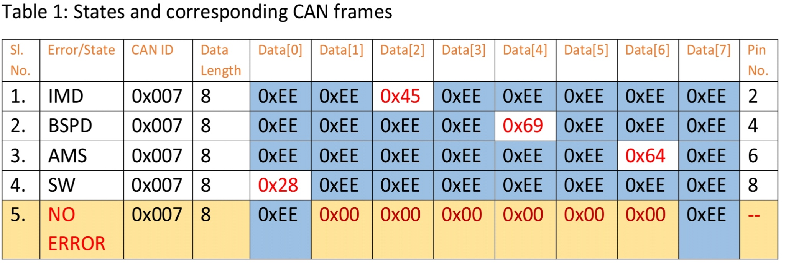

# CAN-Message-Injector

An Arduino based project demonstrating how to interface a CAN (Controller Area Network) module.

The project shows how the status of different devices can be checked and based on the status, a message is sent (CAN Message) on the CAN bus. CAN is commonly used in vehicles. 

For more information about CAN, refer https://en.wikipedia.org/wiki/CAN_bus.

The project requires an Arduino (this has been tested on an Uno) and CAN module (the one used in this is MCP2515). 

The status signals of IMD (Insulation Monitoring Device), BSPD (Break System Plausability Device), AMS (Accumulator Management System) and SW (Shutdown Switch) (as an example) are read into Arduino board’s pins 2, 4, 6 and 8 respectively. When an error is detected, the CAN module sends a unique CAN frame corresponding to the error source, on the CAN bus. The frames are sent, corresponding to the errors as given in the below table:

Also, a unique CAN frame is put on the CAN bus, indicating that no other errors exist, after a given error has corrected. By default, if no error is detected, no CAN frame is transmitted by the CAN module. 

Follow these steps...  
1.Install the mcp2515 [arduino-mcp2515](https://github.com/sudheendra-hegde/CAN-Message-injector/tree/master/arduino-mcp2515)library in Arduino Ide. For more information about installing libraries visit https://www.arduino.cc/en/hacking/libraries  
2.Make the connections as shown in the diagram.  
3.Connect CANL and CANH to the respective CAN Bus (Low and High).  
4.Verify and Upload the program to arduino.  
5.Read the messages at another node.  
